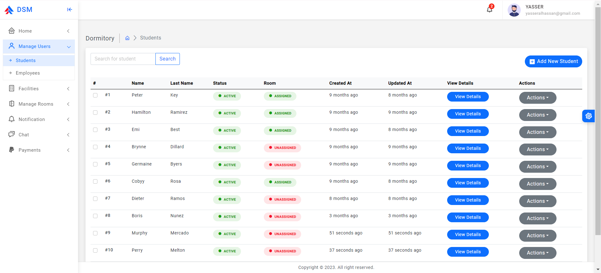
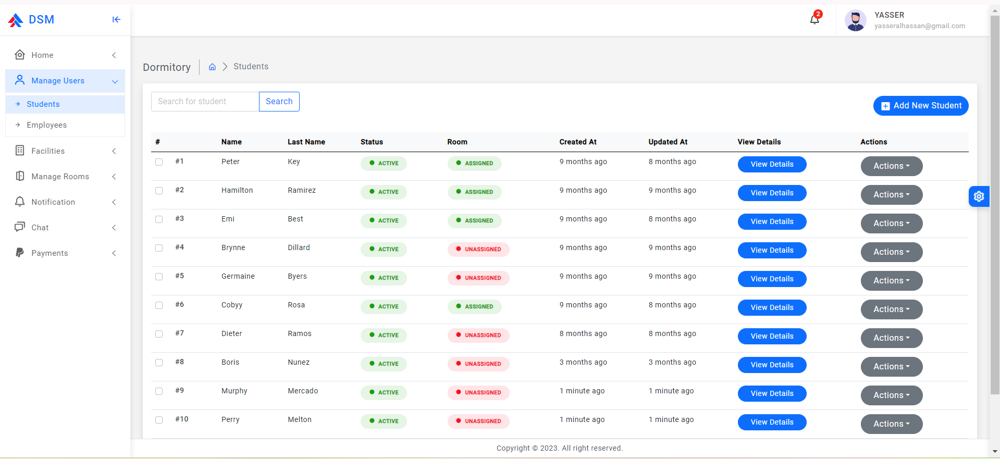
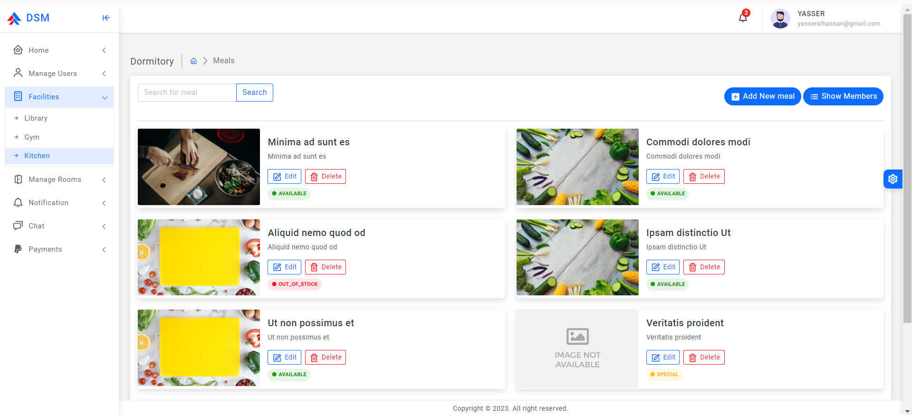
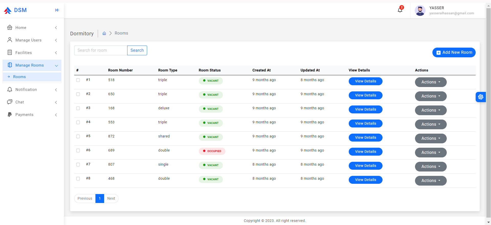
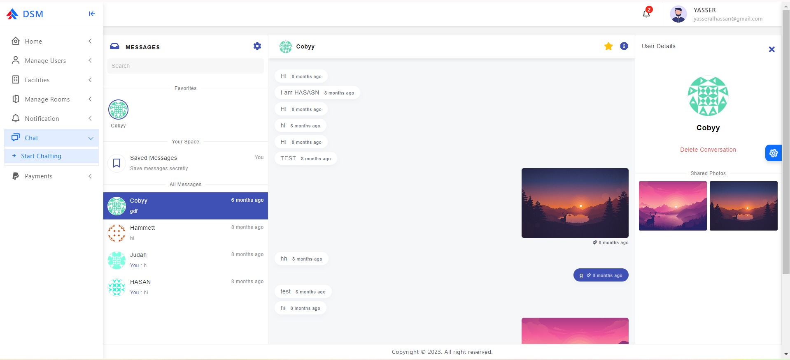
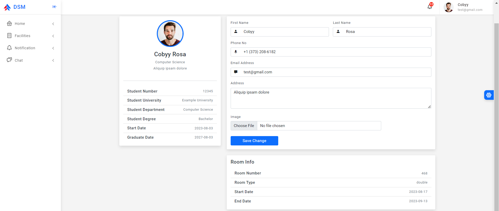
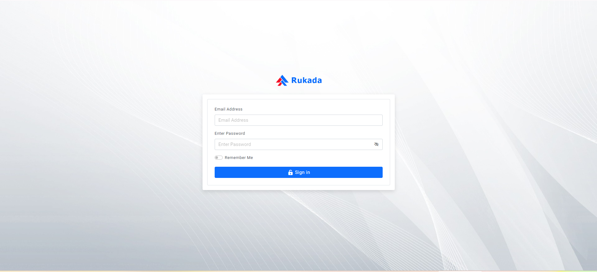

# Dormitory Management System

The Dormitory Management System is a comprehensive software solution designed to streamline the management of dormitory facilities. Whether it's a university dormitory, a hostel, or any other residential facility, this system aims to simplify administrative tasks, enhance communication, and improve overall efficiency.

## Screenshots

